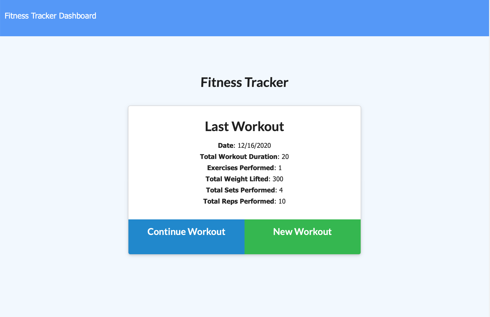
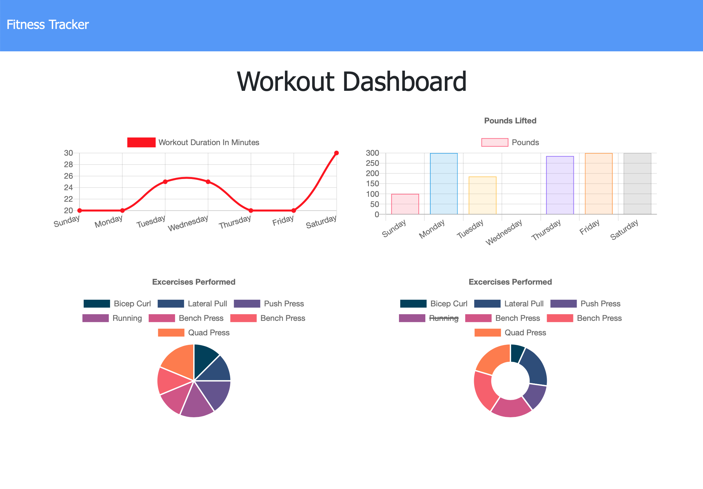

# Workout Tracker

## Description
This application tracks workouts using a Mongo database with a Mongoose Schema and handles routes with Express.

## Installation
To install the necessary dependencies, run the following command: <code>npm install</code>

## Deployed Application
The app is deployed on the following heroku server: [Workout Tracker](https://warm-plateau-27217.herokuapp.com/)

## Demo

